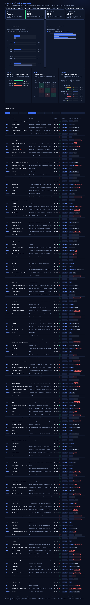

# MBAX 6418 — Assignment 1: Sentiment & Emotion Classification of Amazon Gift-Card Reviews

A working review-sentiment classifier for the Amazon **"Gift Cards"** review category. An LLM classifies each review's *title + text* as **POSITIVE / NEUTRAL / NEGATIVE** and names its primary emotion; a model-free **NRC word list** derives a second, independent emotion take; the model's labels are scored against the reviewer's **star rating** (which the model never sees); and everything is presented in a self-contained, offline **dashboard** (`dashboard.html`).

**The short version:** the model agrees with the rating **72.0%** of the time on a balanced sample (108/150) — but a naive "always positive" baseline scores only 33.3% on that sample, so the model earns its number. The first lopsided run looked near-perfect (98.0%) for an uninteresting reason: 88.5% of the data is positive. The balanced three-class run is where the model's real behavior shows: it is excellent on positive (100%) and negative (98%) reviews and collapses ★3 (neutral) reviews into **NEGATIVE** (33 of 50). Its emotions and the word list's agree only **17.7%** of the time — the word list counts words, not meaning.



*The dashboard (full page capture). It is a single self-contained HTML file: open it, filter the table (All / Matched / Mismatched, class buttons, search), click any row for the full text and raw model output, and hover the red emotion chips for an explanation.*

---

## 1. Data

Amazon Reviews '23 — **"Gift Cards"** category, collected by the **McAuley Lab at UC San Diego**:

- Dataset page: <https://amazon-reviews-2023.github.io>
- Review file (raw, gzipped JSON Lines): `https://mcauleylab.ucsd.edu/public_datasets/data/amazon_2023/raw/review_categories/Gift_Cards.jsonl.gz`

**152,410 reviews** in the category. The star-rating distribution is brutally lopsided:

| Rating | Count | Share |
|---|---:|---:|
| ★1 | 12,326 | 8.1% |
| ★2 | 1,873 | 1.2% |
| ★3 | 3,271 | 2.1% |
| ★4 | 6,692 | 4.4% |
| ★5 | 128,248 | **84.1%** |

As rating-derived classes: **POSITIVE 88.5%, NEUTRAL 2.1%, NEGATIVE 9.3%**. This imbalance is the whole reason the early numbers must be read with suspicion (§3.1).

The review fields used: `rating` (ground truth only, never sent to the model), `title`, `text`, `verified_purchase`, `helpful_vote`, `timestamp`. The raw file is not committed to this repo (large, re-downloadable) — `score.py` reads it from `data/Gift_Cards.jsonl.gz`.

## 2. Pipeline

All Python, **standard library only** (zero pip dependencies), OpenAI-compatible endpoint:

```
data/Gift_Cards.jsonl.gz
   │  score.py         samples (first-N or balanced by fixed seed), classifies via
   │                   the LLM, saves raw rows + summary metrics to output/runs/
   ▼
output/runs/<run>.jsonl
   │  score_emotions.py  adds the NRC word-list emotion take (no model calls)
   ▼
output/runs/<run>_emotions.jsonl
   │  build_dashboard.py  recomputes every number from the saved rows and embeds
   │                      them with the raw rows into one HTML file
   ▼
dashboard.html
```

### The prompt (`prompt.py`)
A parameterized instruction that takes **only** `title` and `text` and demands strict JSON (`{"sentiment": "...", "emotion": "..."}`). The rating never appears in any prompt. Design decisions, all in the prompt text: title/text conflicts → trust the body; terse reviews ("Junk") still carry sentiment; sarcasm counts; two-class mode has no neutral option, three-class reserves NEUTRAL for genuinely flat reviews; the emotion must be one of the NRC's 8 words verbatim.

### The endpoint (`llm.py`)
Class-provided OpenAI-compatible endpoint (`http://dobolyi.com:9001/v1`, model `cyankiwi/Qwen3.6-35B-A3B-AWQ-4bit`). Two endpoint quirks surfaced in setup:

1. The served model is a *reasoning* model: each answer was burning ~490 tokens on a hidden thinking pass before replying. Thinking is disabled (`chat_template_kwargs: {"enable_thinking": false}`), cutting cost per review from ~500 to **~9 completion tokens** with no change in output.
2. `response_format: {"type": "json_object"}` forces machine-readable JSON; a tolerant regex fallback parses stray replies, and unparseable rows are kept and flagged (`parse_fail`), never silently dropped.

### The word list (`score_emotions.py`)
The **NRC emotion lexicon** (Mohammad & Turney, 2013) maps words to the 8 emotions (anger, anticipation, disgust, fear, joy, sadness, surprise, trust). Each review's tokens are looked up, per-emotion scores summed, and the highest total wins. Documented decisions: no stemming (the lexicon already lists inflections), no negation handling (a deliberate blindness — "not happy" still scores joy), and ties broken by the first emotion in a fixed order and **flagged** (`wordlist_tie`) rather than hidden. The 15 rows with no lexicon hits get no word-list emotion. The lexicon (~2.7 MB) is auto-downloaded to `data/` on first use and cached; source cited in §6.

## 3. Findings

### 3.1 Why the lopsided run looked great — and what balancing changed (report question 1)

**Step 2** scored the first 100 rows in file order (two-class: ≥4★ positive, else negative):

| Run | Accuracy | Naive baseline | Model edge |
|---|---:|---:|---:|
| First 100 rows, imbalanced | **98.0%** (98/100) | 93.0% ("always POSITIVE") | +5.0 pts |
| Balanced 150 (seed 42), 3-class | **72.0%** (108/150) | 33.3% ("always one class") | +38.7 pts |

The first run's 98% is mostly echo: 93 of its 100 rows are ★4–5, so an "always positive" classifier scores 93% without reading a word. Balancing the sample (50 rows per class from the whole file, `random.Random(42)` — reproducible, verified identical to the saved run) cuts the baseline to 33.3% and the model to an honest 72.0% that is *38.7 points* above the baseline: the balanced run is doing real work the lopsided run hid. This is also visible on the dashboard's star-rating card: ★5 is 84.1% of the population but only 32% of the balanced sample.

### 3.2 Where the mistakes go (report question 2)

The balanced 3-class confusion matrix (rows = rating-based correct answer, columns = model prediction), 150 rows, 0 parse failures:

| correct → predicted | POSITIVE | NEUTRAL | NEGATIVE | recall |
|---|---:|---:|---:|---:|
| **POSITIVE** (★4–5) | **50** | 0 | 0 | 100% |
| **NEUTRAL** (★3) | 8 | **9** | **33** | 18% |
| **NEGATIVE** (★1–2) | 0 | 1 | **49** | 98% |

Two patterns, with the numbers:

- **★3 reviews collapse into NEGATIVE, not the other way.** 33 of 50 neutral reviews were labeled NEGATIVE, versus only 8 called POSITIVE and 9 correctly NEUTRAL. Negative reviews, meanwhile, almost never get called neutral (1 of 50). So the confusion is one-directional. Reading the actual texts ("don't get change if you get a 50 dollar card", "Why the hell we only have an option with free state tax", "Bad Experience") shows *why*: 3-star writers complain, and the model was told "a review that leans at all gets its leaning label". The rating calls ★3 NEUTRAL by definition; the text often reads as negative. That definitional tension is the root cause.
- **The model never undercuts a positive review** (0 of 50 positives mislabeled) and near-never underwhelms a negative one. Its failures concentrate entirely on the middle class.

The two Step-2 mismatches foreshadowed this: ★3 "Easy to use" ("Very easy to use. I wish I knew about it earlier" — text reads positive, two-class truth forced NEGATIVE) is precisely the ★3 class-boundary problem the balanced run quantifies.

### 3.3 LLM emotion vs word-list emotion (report question 3)

Both takes pick from the same 8 NRC emotions; they agree on the primary emotion only **23.5%** (20/85) of the time on the 100-row run and **17.7%** (22/124) on the balanced run. They disagree for structural reasons, each visible in the data:

| | LLM (balanced run) | Word list (balanced run) |
|---|---:|---:|
| joy | 49 | 16 |
| **anticipation** | **1** | **72** |
| trust | 17 | 11 |
| anger | 56 | 10 |
| disgust | 13 | 1 |
| sadness / surprise / fear | 14 | 14 |

- **The word list counts vocabulary, not meaning.** "gift" — present in 99 of the first 100 reviews — maps to anticipation+joy+surprise in NRC, so the list floods toward anticipation (72 vs the LLM's 1) partly via a tie-break it flags honestly: 52/100 rows tie, and the documented tie rule favors anticipation. The word list cannot read "not $10.00" as a complaint: the ★1 "Not $10 Gift Cards" review scores 8 joy hits from *gift, friends, daughter* while the LLM says anger.
- **The word list has no answer or a wrong answer for short, flat, or sarcastic text** (15/100 rows have zero lexicon hits).
- **Contradictions are one-sided:** 54 word-list emotions contradict the review's own sentiment (joy/trust/anticipation on 1–2★ complaints, anger/disgust on a few 5★) vs **2 for the LLM** — both "surprise" on negative reviews ("GRAND but sukish"). The dashboard marks every contradicted emotion chip in red with a tooltip.
- The LLM's advantage is reading *situation*: it distributes sensibly over the class (anger 56 where negatives dominate the balanced sample), while the word list describes the *topic vocabulary* of gift cards, which is almost all positive words.

### 3.4 Bugs and issues hit along the way (report question 4)

1. **Reasoning-model token burn.** The endpoint's Qwen3 model spent ~490 tokens thinking before each 10-token answer. Fixed by disabling thinking via `chat_template_kwargs` (~50× cheaper; output identical — verified over 100 re-runs).
2. **Out-of-vocabulary emotions.** The model sometimes answered "relief"/"happiness" — not in the NRC-8. Fixed twice: the prompt now demands one of the 8 words verbatim, and a documented synonym map (`relief → joy`, …) normalizes the residual cases into the shared emotion space. Unmapped values are recorded as `emotion_missing`, not dropped.
3. **Save-path crash.** The scorer wrote to `output/runs/` before creating it — a `FileNotFoundError` after 100 successful classifications. Fixed with `os.makedirs`.
4. **Dashboard JS bugs** (all found by re-reading code, then re-rendering in a browser): a `firstChild`+`children` duplication rendered the header twice; `append()` results were used as if they were elements (two legends vanished); and the table's first render ran before its section was attached to the DOM, making the live-count update throw. The last one was the kind of bug that renders a page fine "by eye" — a quick DOM probe in the browser caught it.
5. **A literal `<small>` tag** showed up as text in a KPI because a helper sets `textContent`, not HTML.
6. **Float-vs-int key bug in the population chart.** The new sample-vs-population rating bars rendered "—" for every population row: the population side counted star ratings as floats (`1.0`) while the sample side used ints (`1`). Caught by the Step-7 browser verification (the assignment's "check the numbers in the browser, not by eye"), fixed in one line, re-verified.
7. **Zero-width bar risk.** The assignment warned about chart elements collapsing to zero width; every bar gets `min-width: 2px` plus an always-visible count label, and a layout audit measured all 35 bars on the final page (none zero-width, none overflowing).
8. **Process note:** an early dashboard run looked great in a screenshot but had thrown during table render — screenshots alone are not verification. Every number on the final page was pulled from the rendered DOM and compared programmatically against a from-scratch recompute of the saved run output (all matched), and the check suite itself caught two of its own bugs before the final pass.

## 4. Reproducibility

- **Fixed seed:** the balanced sample uses `random.Random(42)`; re-running selects the *identical* 150 rows (verified against the saved run's indices).
- **Fixed model settings:** temperature 0, thinking disabled, deterministic endpoint → the Step-2 and Step-5 runs produced *identical* sentiment labels for all 100 shared rows.
- **Deterministic word list:** re-deriving emotions over both saved runs reproduced every row exactly (0/250 differences).
- **Deterministic dashboard:** regenerating `dashboard.html` from the same run is byte-identical (sha256).
- All quoted numbers above come from `output/runs/step6_balanced3_emotions.jsonl` (the balanced run's raw output, committed) and its summaries; the dashboard recomputes from the same file, so the page and this report cannot drift apart.

## 5. How to run

```bash
# 0. (once) fetch the data into data/, and let the NRC lexicon auto-download
#    (score_emotions.py) — nothing to pip install, stdlib only

# Step 2-style run: first 100 rows, two-class
python3 score.py --mode first --n 100 --classes 2 --name step2_first100

# Step 5/6 run: balanced 50 per class, fixed seed 42, three-class + emotions
python3 score.py --mode balanced --per-class 50 --seed 42 --classes 3 \
                 --emotions --name step6_balanced3

# word-list emotions + LLM-vs-word-list comparison
python3 score_emotions.py --run step6_balanced3

# regenerate the dashboard from a saved run (final dashboard):
python3 build_dashboard.py --run step6_balanced3_emotions -o dashboard.html
open dashboard.html            # self-contained, offline
```

Run outputs land in `output/runs/` as JSON Lines (one review per line: rating, title, text, correct class, predictions, raw model output) plus `*_summary.json` metrics. Endpoint/key/model are config constants at the top of `llm.py`. The data download: the referenced McAuley Lab URL, saved as `data/Gift_Cards.jsonl.gz`.

## 6. Credits

- **Data:** Ni, J., Li, J., & McAuley, J. (2023). *Justifying Recommendations using Distantly-Labeled Reviews and Fine-Grained Aspects* / Amazon Reviews '23 dataset, McAuley Lab, UC San Diego — <https://amazon-reviews-2023.github.io>. Raw review file hosted by the McAuley Lab public dataset server.
- **Emotion lexicon:** Mohammad, S. M., & Turney, P. D. (2013). *Crowdsourcing a Word-Emotion Association Lexicon* (NRC Emotion Lexicon v0.92), National Research Council Canada. The word-level file is fetched from a public mirror of the lexicon (original distribution is by request): `github.com/dinbav/LeXmo`.
- **Model:** `cyankiwi/Qwen3.6-35B-A3B-AWQ-4bit` served on the class OpenAI-compatible endpoint (vLLM).
- Built with Python 3.13, standard library only; dashboard is hand-built HTML/CSS/JS with no external libraries.
